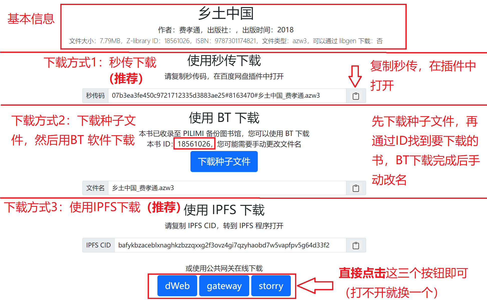
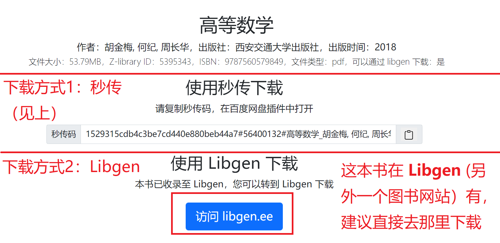
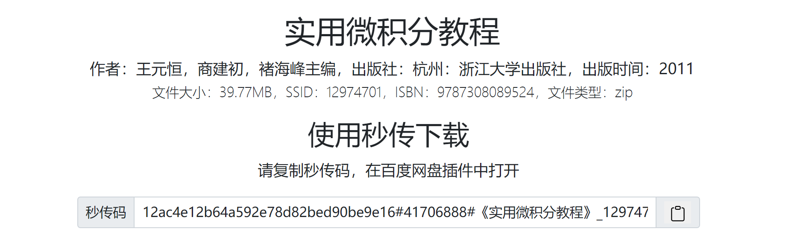

Ylibrary 搜素引擎，用于检索去中心化共享出来的电子书。

<!--more-->

## 使用教程

打开 [Ylibrary](https://search.ylibrary.org/)

输入关键词，点击搜索。关键词支持：ISBN（不一定能搜到）、作者、出版社、书名。

搜索结果展示界面，每一页展示 20 条结果，拉到最下面可以往后翻页。每个搜素结果都可以直接点击。

Ylibrary 搜素引擎不存储任何书籍，Ylibrary 只是一个搜索工具，数据来自于互联网公开信息，Ylibrary仅仅只是提供索引。以下教程将帮助您从**去中心化文件分享网络**中获取资源

下载详情界面有三种不同版本。此外，关于 Libgen 与秒传的使用方法，以及超星压缩档的处理方法，可以参考以下文档：

- Libgen 下载 [详细教程](https://bbs.yibook.org/d/391-hui-fu-xia-zai-fang-shi-9-jie-zhu-libgen-ti-dai-xia-zai)
- 秒传 [详细教程](https://ssdown.org/blog/miaochuan/)
- 超星压缩档 [详细教程](https://ssdown.org/blog/miaochuan/)

### 第一种版本

第一种版本有三种下载方式。

 

### 第二种版本

第二种版本有两种下载方式。

 

### 第三种版本

第三种版本只能秒传下载，均为 读秀库的资源。这些书籍基本可以秒传成功。

 